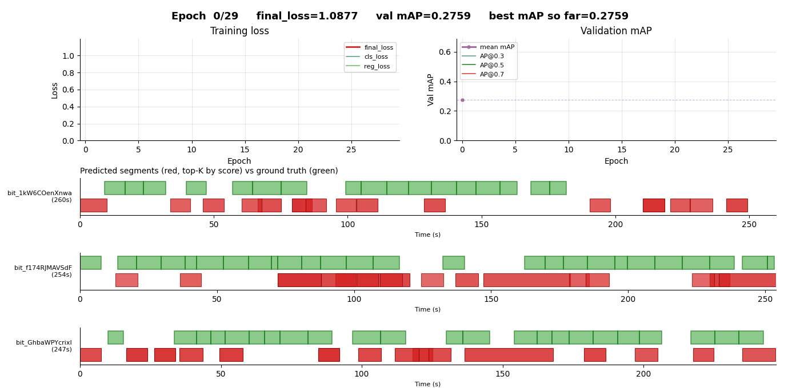

# Hateful Content Localization

**DISCLAIMER: THIS PROJECT WORKS ON LOCALISING HATEFUL CONTENT, SO YOU MAY BE EXPOSED TO SENSITIVE CONTENT**



## References
A portion of the code seen here was ported from the following TAL models:

- ActionFormer : https://github.com/happyharrycn/actionformer_release
- TemporalMaxer: https://github.com/TuanTNG/TemporalMaxer
- TriDet       : https://github.com/dingfengshi/TriDet

This is the dataset used

- HateClipSeg  : https://github.com/Social-AI-Studio/HateClipSeg

## Directory Structure

```text
hateful content localisation/
├── data/
│   ├── extract_features.py            # extracts video/audio/text features from raw videos at a chosen fps
│   └── hateclipseg/
│       ├── dataset/
│       │   ├── videos/                # raw .mp4 clips (downloaded separately)
│       │   ├── segment_level_annotation.csv  # original HateClipSeg segment annotations
│       │   └── hateclipseg.json       # consolidated annotations + train/val/test split
│       ├── scripts/
│       │   ├── download_dataset.py    # for downloading the dataset videos manually
│       │   └── prepare_annotations.py # for converting the raw dataset csv to a compatible json
│       ├── 1fps/                      # pre-extracted features at 1 fps
│       │   ├── video_features/
│       │   ├── audio_features/
│       │   └── text_features/
│       ├── 2fps/                      # pre-extracted features at 2 fps
│       └── 4fps/                      # pre-extracted features at 4 fps
│
├── src/
│   ├── train.py                       # trains a single model from a yaml config
│   ├── eval.py                        # evaluates a trained checkpoint
│   ├── run_experiments.py             # runs every config in configs/experiments/ across multiple seeds
│   ├── visualise_predictions.ipynb    # notebook for plotting predicted vs ground truth segments
│   ├── configs/
│   │   └── experiments/               # one yaml per experiment
│   ├── libs/
│   │   ├── datasets/
│   │   │   └── hateclipseg.py         # HateClipSeg torch Dataset
│   │   ├── modeling/
│   │   │   ├── meta_arch.py           # top level model: preprocessor -> backbone -> neck -> heads
│   │   │   ├── feature_preprocessors.py  # unimodal / concat preprocessors
│   │   │   ├── trifuse.py             # trifuse preprocessor
│   │   │   ├── backbone.py            # transformer / temporalmaxer / sgp backbones
│   │   │   ├── blocks.py              # shared building blocks (attention, sgp, conv, etc.)
│   │   │   └── heads.py               # standard and trident classification/regression heads
│   │   └── utils/
│   │       ├── config_utils.py        # yaml loader
│   │       ├── train_utils.py         # optimizer, lr scheduler, EMA, focal/DIoU loss, training loop
│   │       ├── eval_utils.py          # mAP computation and per-tIoU metrics
│   │       └── nms.py                 # Soft-NMS over predicted segments
│   └── runs/
│       └── exp/
│           └── <experiment_name>/
│               └── seed_<seed>/
│                   ├── checkpoint.pth.tar   # last epoch state
│                   └── model_best.pth.tar   # best val mAP checkpoint
│
├── requirements.txt
└── README.md
```

## Installation and Setup

### Environment and Dependencies

```bash
# create conda environment
conda create -n hcl python=3.11 -y
conda activate hcl
# install torch along with cuda support (this was the version compatible with a RTX 5080)
pip install torch==2.10.0 torchaudio==2.10.0 torchvision==0.25.0 \
    --index-url https://download.pytorch.org/whl/cu128
# install rest of the dependencies
pip install -r requirements.txt
pip install git+https://github.com/openai/CLIP.git
# ffmpeg installation if you do not have it your system
conda install ffmpeg
```

### Preparing Codebase

 - dataset videos can be downloaded from https://universityofexeteruk-my.sharepoint.com/:f:/g/personal/gs701_exeter_ac_uk/IgD0Su8sJzczTZh4KT8W3CKoAadINussf7ZNEWtHkMmiFio?e=vJ3HzE and placed into:
 ```bash
 data/hateclipseg/dataset/videos/
 ```

 - extracted features (1fps, 2fps and 4fps) can be downloaded from https://universityofexeteruk-my.sharepoint.com/:f:/g/personal/gs701_exeter_ac_uk/IgDSSBTypW9iTaCL3_YRsDgTAVG0-pTagIpmdwRn5jXOaN8?e=L4YJsd and placed into:
 ```bash
 data/hateclipseg/
 ```

 - the models I trained during my experiments can be downloaded from https://universityofexeteruk-my.sharepoint.com/:u:/g/personal/gs701_exeter_ac_uk/IQDYuSQXedIuR5pyr22TxY-vAcY4ZzgE6n-2xp7jDb5VIJU?e=CPw1xn and placed into:
 ```bash
 src/runs/
 ```

## Config File Structure
```yaml
dataset:
  name: "hateclipseg"
  # paths to extracted features
  video_feat_dir: "../../../data/hateclipseg/1fps/video_features"
  audio_feat_dir: "../../../data/hateclipseg/1fps/audio_features"
  text_feat_dir:  "../../../data/hateclipseg/1fps/text_features"
  # path to annotated dataset
  annotation_file: "../../../data/hateclipseg/dataset/hateclipseg.json"
  # flags to decide whether to use the random stratified split of json split
  use_json_split: false
  split_seed: 42

  # information on how the dataset is structured
  # number of foreground classes (1 = binary hate/no-hate)
  num_classes: 1
  # features per second of the extracted features
  feature_fps: 1.0
  # longer sequences are randomly cropped, shorter ones zero-padded
  max_seq_len: 512
  # original dim of each pre-extracted feature stream
  input_dims:
    text: 768
    audio: 1024
    video: 768


# 3 preprocessor options (CHOOSE ONE) ------------
preprocessor:
  # only one modality is passed into the backbone
  type: "unimodal"
  modality: "video"

preprocessor:
  # used up to all three modalities (video, audio, text)
  # and concatenate them before passing them into the
  # backbone
  type: "concat"
  modalities: ["video", "audio"]
  # chance for a whole modality to be zerod out during
  # training
  modality_dropout: 0.1

preprocessor:
  # uses all three modalities and fuses them using CMA
  type: "trifuse"
  # dimension to linearly project all modalities to
  # before cross modal attention
  d_model: 768
  # number of heads used in multi head attention
  n_heads: 4
  # how many sequential cma blocks
  n_fusion_layers: 1
  # dropout rate for the weights in trifuse
  dropout: 0.1
  modality_dropout: 0.1
# end of preprocessor options ------------


# 3 backbone options (CHOOSE ONE) ------------
backbone:
  # Actionformer backbone
  type: "transformer"
  # internal feature dim throughout the backbone
  d_model: 512
  # number of initial 1D conv projection layers
  n_proj_layers: 2
  # total number of transformer blocks
  n_layers: 5
  # number of heads in each block's multi head attention
  n_heads: 4
  # local attention window size (-1 = global attention)
  window_size: 17
  # index of the first downsampling block (preceding blocks keep stride 1)
  downsample_start: 1
  # temporal stride per downsampling block (forms the FPN pyramid)
  downsample_ratio: 2

backbone:
  # TemporalMaxer backbone
  type: "temporalmaxer"
  d_model: 512
  n_proj_layers: 2
  n_layers: 5
  # unused, only for API compatibility 
  n_heads: 4
  window_size: 17
  downsample_start: 1
  downsample_ratio: 2
  # kernel size of the MaxPool1D op in each block
  pool_kernel_size: 3

backbone:
  # TriDet backbone (Scalable-Granularity Perception layers)
  type: "sgp"
  d_model: 512
  n_proj_layers: 2
  n_layers: 5
  # unused, only for API compatibility 
  n_heads: 2
  window_size: 17
  downsample_start: 1
  downsample_ratio: 2
  # kernel size of the instant-level depthwise conv inside each SGP block
  sgp_kernel_size: 3
  # hidden dim of the position-wise FFN inside each SGP block
  sgp_mlp_dim: 768
  # scale factor controlling the window-level branch's receptive field
  sgp_k: 1.5
  # std of the Gaussian init for SGP depthwise conv weights
  sgp_init_conv_vars: 1
  # downsampling op used in branch SGP blocks ("max" or "avg")
  sgp_downsample_type: "max"
# end of backbone options ------------


neck:
  type: "identity"

# 2 head options (CHOOSE ONE) ------------
heads:
  # Actionformer head: classifier + (d_start, d_end) offset regressor
  type: "standard"
  # number of conv layers in each head stack (including the final pred layer)
  n_layers: 2
  # conv kernel size in the intermediate head layers
  kernel_size: 3
  # apply LayerNorm after each intermediate conv
  use_layer_norm: true

heads:
  # TriDet head with distribution-based boundary localization
  type: "trident"
  n_layers: 2
  kernel_size: 3
  use_layer_norm: true
  # kernel size for the start/end boundary sub-heads
  boundary_kernel_size: 3
  # number of bins in the boundary offset distribution
  num_bins: 16
  # exponent for IoU-weighted classification loss
  iou_weight_power: 2
# end of head options ------------


# segment-length range (in feature strides) handled at each pyramid level
# MUST contain one entry per FPN level produced by the backbone
regression_ranges:
  - [0,    4]
  - [4,    8]
  - [8,   16]
  - [16,  32]
  - [32,  100000]

loss:
  # foreground weight in focal loss (balances class imbalance)
  focal_alpha: 0.45
  # focal loss exponent (higher = stronger down-weighting of easy samples)
  focal_gamma: 2.0
  # weight of the regression (DIoU) loss relative to classification
  lambda_reg: 1.0
  # restrict positive assignments to a radius around segment centers
  center_sampling: true
  # radius (in strides) used when center_sampling is true
  center_sampling_radius: 2.0

training:
  batch_size: 8
  epochs: 30
  # initial learning rate (AdamW)
  learning_rate: 1.0e-4
  # L2 regularization on weights
  weight_decay: 1.0e-3
  # linear warmup duration before the main scheduler kicks in
  warmup_epochs: 5
  # main lr schedule: "cosine" or "multistep"
  lr_scheduler: "cosine"
  # maintain an exponential moving average of weights, used at inference
  use_ema: true
  ema_decay: 0.999
  # max global grad norm before optimizer step (0 = disabled)
  clip_grad_norm: 1.0
  # prior probability used to bias-init the classifier
  cls_prior_prob: 0.01
  # dropout rate in backbone projection and head layers
  dropout: 0.2
  # stochastic depth (drop-path) rate in backbone blocks
  droppath: 0.1
  # label smoothing applied to classification targets (0 = off)
  label_smoothing: 0.00
  # epochs without val mAP improvement before early stopping
  patience: 10

augmentation:
  enabled: true
  # std of Gaussian noise added to valid feature frames
  feature_noise_std: 0.02
  # max frames to shift the sequence left or right
  temporal_shift_max_frames: 8

inference:
  # min confidence to keep a detection before NMS
  score_threshold: 0.001
  # "soft_nms" (Gaussian Soft-NMS) is the only option
  nms_method: "soft_nms"
  # Gaussian decay factor in Soft-NMS (lower = more aggressive suppression)
  nms_sigma: 0.4
  # min score during Soft-NMS iteration (segments below this are dropped)
  nms_threshold: 0.1
  # max number of segments output per video
  max_detections: 200
```

## Downloading Dataset

In case if you don't want to download the dataset from the link provided, you could instead use the ```data/hateclipseg/scripts/download_dataset.py``` script.
You will need ffmpeg to use it.

## Feature Extraction

If you don't want to download the extracted features from the link provided, you can extract the features using the following command:

```bash
python extract_features.py --video_dir /path/to/hateclipseg/videos \\
                           --out_dir   data/hateclipseg/1fps \\
                           --fps       1
```

**IT WILL TAKE ABOUT 4 HOURS TO EXTRACT USING AN RTX 5080**

## Run Experiments seen in the report

To run the abalation studies seen in the dissertation report, simply run the following command while in the src directory:

```bash
python run_experiments.py --seeds 42,123,6767
```

**Running all experiments will take a long time (10 hours on a RTX 5080 with 16GB of VRAM)**

Instead, to train individual models/configs, follow this command:

```bash
python train.py --config configs/config.yaml --output_dir runs/test_run
```

## Evaluation

Trained models can be evaluted using the following command:

```bash
python eval.py --config configs/config.yaml --checkpoint runs/test_run/model_best.pth.tar
```

If you downloaded the models I trained or ran the ablation studies yourself, you could also get a summary table by simply running:

```bash
python run_experiments.py
```

## Visualising Model Predictions

To show model predictions use the ```visualise_predictions.ipynb``` notebook. You should only have to validate that the config and checkpoint path are correct. Then you can run all cells.
